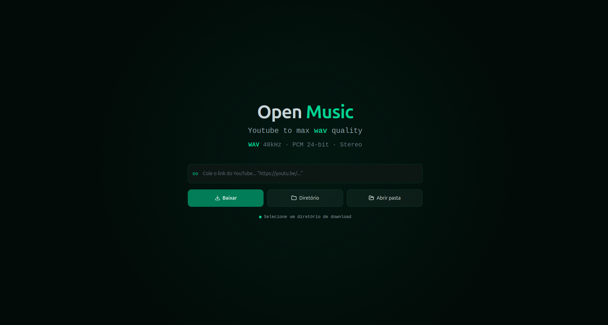

# Open Music

<p align="center">
  
</p>

Download YouTube music and playlists as **WAV 48kHz 16-bit stereo**.

---

## Prerequisites

- Python 3.12+
- Node.js 22+
- [FFmpeg](https://ffmpeg.org/)

---

## Getting Started

**Terminal 1 — Backend (API):**

```bash
cd backend
python3 -m venv .venv
source .venv/bin/activate
pip install -r requirements.txt
fastapi dev
```

API at `http://localhost:8000` · Interactive docs at `http://localhost:8000/docs`

**Terminal 2 — Frontend (UI):**

```bash
cd frontend
npm install
npm run dev
```

UI at `http://localhost:3000`

---

## Web Interface

### Download a single track

1. Open `http://localhost:3000`
2. Paste a YouTube Music URL
3. Click **Baixar** (Download)
4. Wait for conversion — the status updates to **Concluido**

### Open download folder

- Click **Abrir pasta** to open the download directory
- Click **Diretorio** to change the download path

---

## CLI Usage

Download a single track via terminal:

```bash
cd backend
source .venv/bin/activate
python download.py "https://music.youtube.com/watch?v=..."
```

WAV is saved to `~/Music/Neo/Genero/<title>.wav`.

---

## Accepted URLs

| Type | Example |
|------|---------|
| YouTube | `https://www.youtube.com/watch?v=dQw4w9WgXcQ` |
| YouTube Music | `https://music.youtube.com/watch?v=tJPjNqFxH20` |
| Playlist | `https://www.youtube.com/playlist?list=PL...` |
| Short link | `https://youtu.be/dQw4w9WgXcQ` |

---

## File Structure

```
~/Music/Neo/Genero/
├── My Track.wav
└── My Playlist/
    ├── Track 1.wav
    ├── Track 2.wav
    └── Track 3.wav
```

---

## Advanced Configuration

Audio settings can be changed via environment variables:

| Variable | Default | Description |
|----------|---------|-----------|
| `NEO_DOWNLOADS_DIR` | `~/Music/Neo/Genero` | Output directory |
| `NEO_AUDIO_SAMPLE_RATE` | `48000` | Sample rate (Hz) |
| `NEO_AUDIO_CODEC` | `pcm_s16le` | Audio codec |
| `NEO_AUDIO_CHANNELS` | `2` | Channels (2 = stereo) |
| `NEO_AUDIO_FORMAT` | `wav` | Container format |

---

## Troubleshooting

| Problem | Solution |
|----------|---------|
| `ffmpeg not found` | Install ffmpeg (`sudo apt install ffmpeg` on Linux) |
| `Video unavailable` | Update yt-dlp: `pip install -U yt-dlp` |
| Error 403 / blocked | YouTube may be blocking — try again or update yt-dlp |
| Frontend can't connect | Make sure backend is running on `localhost:8000` |
